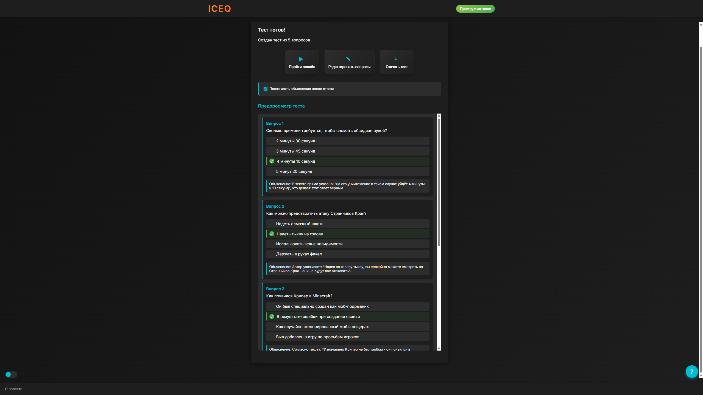

<center></center>
<br>

**ICEQ** (Input, Chunks, Embeddings, Questions) — это приложение, которое автоматически генерирует вопросы на основе объемного текста. Оно помогает пользователям лучше понимать и анализировать информацию, предлагая вопросы для проверки владения материалом.

## Как работает алгоритм?

1. Текст по абзацам разбивается на ```чанки```. Чанки фильтруются и векторизуются.

<center></center>

2. Эмбеддинги чанков кластеризуется на ```количество_чанков * 0.01``` кластеров. Из каждого кластера берётся ближайший к центру кластера объект.
<center></center>

3. Центральные объекты каждого кластера передаются на вход ```LLM (DeepSeek)``` при помощи ```API```.

## Возможности
- Обработка длинных текстов
- Генерация вопросов на основе содержимого

## Установка

1. Клонируйте репозиторий:
   ```bash
   git clone https://github.com/droyti46/iceq.git
   cd iceq
   ```
2. Установите зависимости:
   ```bash
   pip install -r requirements.txt
   ```

## Использование
Перейдите в папку ```src```
```bash
cd src
```
Создайте файл ```.env``` и добавьте в него свой ключ DeepSeek API

```
DEEPSEEK_API_KEY=<Your API key>
```

### Python интерфейс
```python
from generation import QuestionsGenerator

with open('text.txt', 'r', encoding='utf8') as f:
   text = f.read()

# Генерация 10 вопросов по тексту
generator = QuestionsGenerator()
questions = generator.generate(text, 10)
```

```QuestionsGenerator.generate(text: str, questions_num: int) -> list[dict]``` возвращает список со словарями. Каждый словарь представляет из себя описание вопроса:

```json
{
   "question": str,
   "answers": [{"answer": str, "is_correct": bool}, ...],
   "explanation": str
}
```

### Графический Web интерфейс
1. Запустите сервер
   ```bash
   python app.py
   ```
2. Перейдите на запущенный локальный сервер ```http://127.0.0.1:8080/```
<p align="center">
  
  
</p>


## Авторы
- [Сергей Катцын](https://github.com/phantom2059)
- [Никита Бакутов](https://github.com/droyti46)
- [Глеб Петров](https://github.com/KarnnaGQ)
- [Дмитрий Буря](https://github.com/LostNepis)
- [Никита Кузнецов](https://github.com/nasfok)