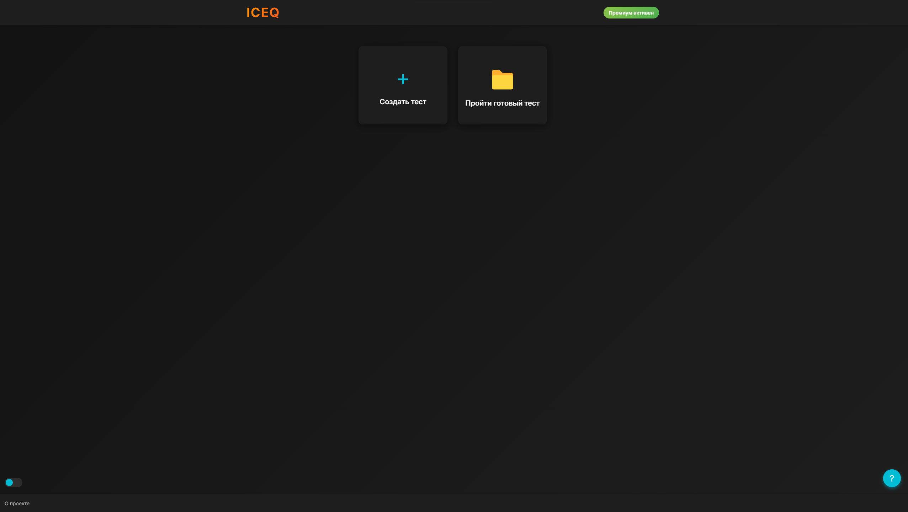

<p align="center"></p>
<p align="center"><b>ICEQ</b> (Input, Chunks, Embeddings, Questions) — это умное приложение для автоматической генерации вопросов по тексту с использованием передовых технологий ИИ. Превращайте любой текст в интерактивные тесты и викторины!</p>

<div align="center">
  <h3>🧠 Core ML & NLP</h3>
  <p>
    
    
    
  </p>
  
  <h3>📊 Data & Math</h3>
  <p>
    
    
    
    
  </p>
  
  <h3>🌐 Web & API</h3>
  <p>
    
    
    
    
  </p>
  
  <h3>🛠 Utilities & Tools</h3>
  <p>
    
    
    
    
  </p>
</div>

## Как работает алгоритм?

1. Текст по абзацам разбивается на ```чанки```. Чанки фильтруются и векторизуются.

<p align="center"></p>

2. Эмбеддинги чанков кластеризуется на ```количество_чанков * 0.01``` кластеров. Из каждого кластера берётся ближайший к центру кластера объект.
<p align="center"></p>

3. Центральные объекты каждого кластера передаются на вход ```LLM```.

## Обучение модели

<p align="center"><a href="https://www.kaggle.com/datasets/nikitabakutov/iceq-dataset">
  
</a></p>

В рамках проекта была дообучена языковая модель [t-tech/T-lite-it-1.0](https://huggingface.co/t-tech/T-lite-it-1.0) на генерацию вопросов по фрагментам текста

## Возможности
- Обработка длинных текстов
- Генерация вопросов на основе содержимого

## Установка

1. Клонируйте репозиторий:
   ```bash
   git clone https://github.com/phantom2059/ICEQ.git
   ```
2. Установите зависимости:
   ```bash
   pip install -r requirements.txt
   ```

## Использование
Перейдите в папку ```src```
```bash
cd src
```
Создайте файл ```.env``` и добавьте в него свой ключ DeepSeek API

```
DEEPSEEK_API_KEY=<Your API key>
```

### Python интерфейс

```python
from generation import QuestionsGenerator

with open('text.txt', 'r', encoding='utf8') as f:
    text = f.read()

# Генерация 10 вопросов по тексту
generator = QuestionsGenerator()
questions = generator.generate(text, 10)
```

```QuestionsGenerator.generate(text: str, questions_num: int) -> list[dict]``` возвращает список со словарями. Каждый словарь представляет из себя описание вопроса. Пример словаря:

```json
{
   "question": "Кто является автором романа «Евгений Онегин»?",
   "answers": [
      {
         "answer": "Александр Пушкин",
         "is_correct": true
      },
      {
         "answer": "Лев Толстой",
         "is_correct": false
      },
      {
         "answer": "Фёдор Достоевский",
         "is_correct": false
      },
      {
         "answer": "Николай Гоголь",
         "is_correct": false
      }
   ],
   "explanation": "Роман в стихах «Евгений Онегин» написан Александром Сергеевичем Пушкиным и является одним из ключевых произведений русской литературы."
}
```

### Графический Web интерфейс
1. Запустите сервер
   ```bash
   python app.py
   ```
2. Перейдите на запущенный локальный сервер ```http://127.0.0.1:8080/```
<p align="center">
  
  
</p>

## Авторы
- [Сергей Катцын](https://github.com/phantom2059)
- [Никита Бакутов](https://github.com/droyti46)
```
╔══════════════════════════════════════════════════════════════════════════════╗
║                                    ⭐ ICEQ ⭐                               ║
║                        Создаём будущее образования с ИИ                      ║
╚══════════════════════════════════════════════════════════════════════════════╝
```
